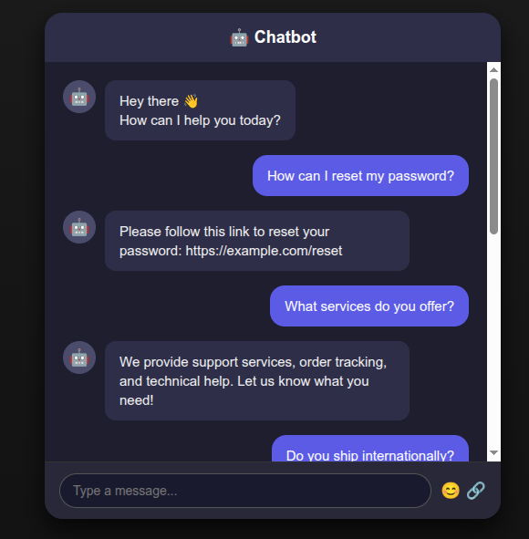
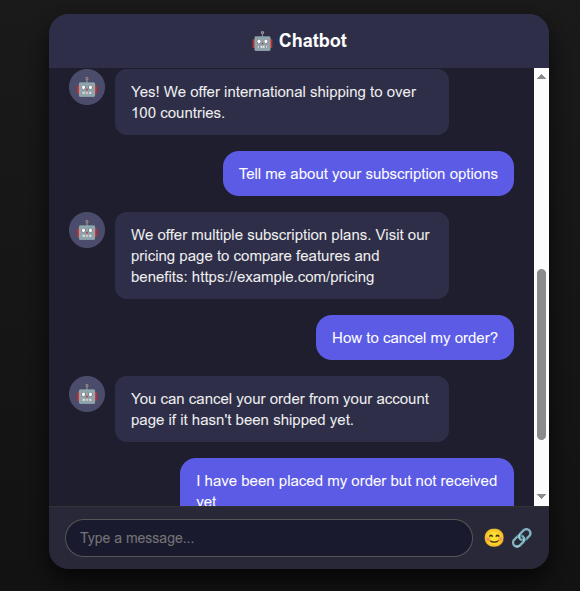

# Customer Support Chatbot

This project is an AI-powered **Customer Support Chatbot** developed as part of our academic project. It aims to automate responses to common customer queries using Natural Language Processing (NLP) and Machine Learning.

## Features

- Automatically responds to frequently asked questions
- Text preprocessing and typo correction
- TF-IDF based vectorization
- Intent classification using Logistic Regression
- Fallback responses for unknown queries
- Terminal-based user interaction

## Technologies Used

- Python 3.x  
- NLTK  
- scikit-learn  
- NumPy  
- Pandas  

## Installation

1. **Clone the repository**
   ```bash
   git clone https://github.com/baraths-codes/customer-support-chatbot.git
   cd customer-support-chatbot

## Demo 

Here is a demo of how the chatbot works:
heres a deployment of chatbot link, 
https://customer-support-chatbot-j8fd.onrender.com/





